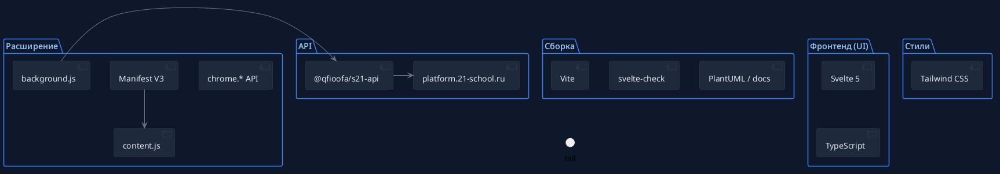

# Helper S21

Вспомогательное расширение для браузера, которое делает работу с платформой
[S21](https://platform.21-school.ru) удобнее: профиль, XP, кампус и события —
прямо в popup расширения.

<p align="center">
  
</p>

---

## Ключевые возможности

- **Дашборд** — карта кампуса, продажи (Sales) и события в одном окне
- **Профиль** — уровень, XP, PRP и место в топе без захода на сайт
- **Поиск участников** — полные данные по нику в пару кликов
- **Навыки** — список навыков с накопленным XP
- **Авторизация** — хранение токена, вход и контроль статуса
- **Настройки и логи** — тёмная тема, компактные острова, подробный журнал

## Стек

<p align="center">
  
</p>

- **Svelte 5** + **TypeScript**, **Vite**, **Tailwind CSS**
- **Manifest V3**: `background.js` (service worker) + `content.js`
- API-клиент **@qfioofa/s21-api**

## Структура проекта

<p align="center">
  
</p>

```text
src/
├── core/             # stores, registry, logger
├── api/              # client, session, peer
├── infra/chrome/     # auth, token, cookies
└── ui/               # layout, island-виджеты (Svelte)
```

## Установка (Chrome)

Полная инструкция — в [docs/INSTALLATION.md](docs/INSTALLATION.md).

```bash
npm install
npm run build        # сборка в dist/
# chrome://extensions → Developer mode → Load unpacked → выбрать dist/
```

## Команды

```bash
npm run dev          # dev-сервер Vite
npm run build        # production-сборка в dist/
npm run check        # svelte-check / typecheck
npm run format       # prettier
npm run release      # release-конвейер (build + typecheck + отчёт)
plantuml -tpng diagrams/*.puml   # перегенерировать диаграммы
```

## Лицензия

Проект распространяется по лицензии [MIT](LICENSE).
